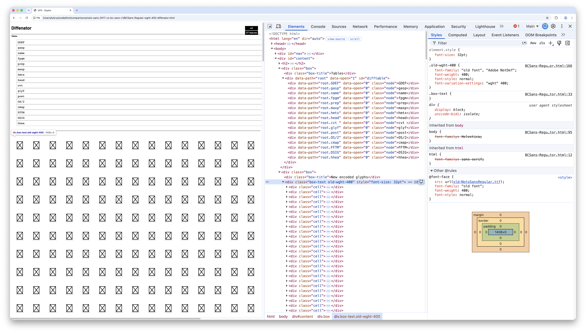
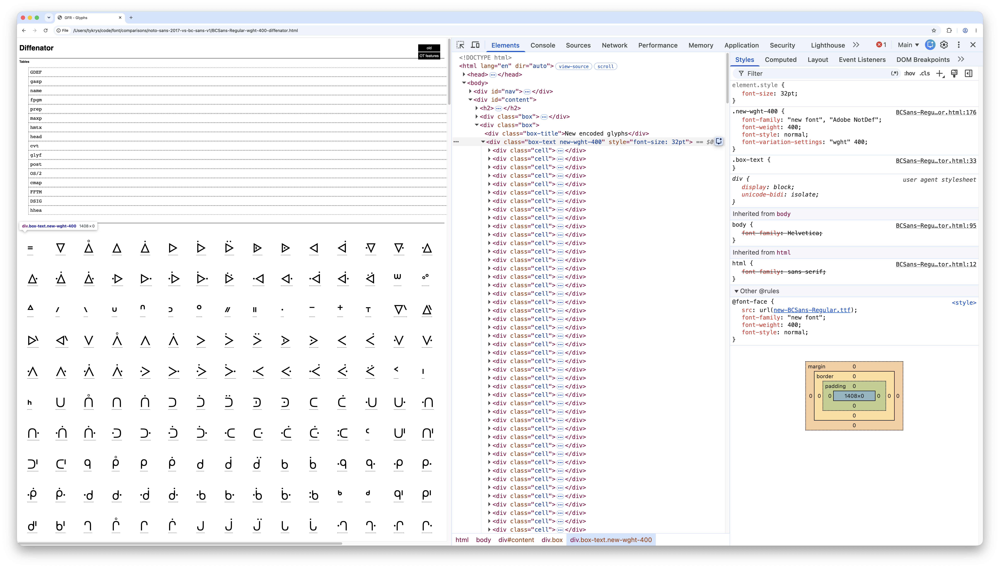

# Font comparisons

## Noto Sans 2017 vs BC Sans v1

See [`comparisons/noto-sans-2017-vs-bc-sans-v1`](./comparisons/noto-sans-2017-vs-bc-sans-v1/) folder for output of this comparison.

This compares the version of Noto Sans from commit [90ef993387c0](https://github.com/notofonts/noto-source/commit/90ef993387c0) with BC Sans v1.

Script:

```sh
# -fb == --fonts-before, -fa == --fonts-after
diffenator2 diff --fonts-before ./fonts/noto-sans/hash/90ef993387c0/NotoSansRegular.ttf --fonts-after ./fonts/bc-sans/v1/print/BCSans-Regular.ttf -o comparisons/noto-sans-2017-vs-bc-sans-v1 --filter-styles "Regular"
```

Note that initially when loading [`BCSans-Regular-wght-400-diffenator.html`](./comparisons/noto-sans-2017-vs-bc-sans-v1/BCSans-Regular-wght-400-diffenator.html) in a browser, tofu squares are visible in the "New encoded glyphs" section. This seems to be a logic bug in the output where a CSS class for the "old" font (Noto Sans in our comparison) is being applied when we would expect a "New encoded glyphs" section to be displaying the "new" font (BC Sans in our comparison).



After changing the CSS class to use `new` instead of `old`, the glyphs appear as expected.



I've checked the original output of the `diffenator2 diff` command in rather than a manually fixed version.
